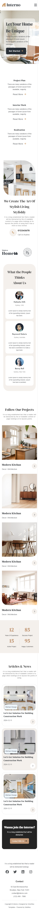

# 室內設計品牌網站 · Interior Design Website

以室內設計品牌為主題的響應式網頁，使用純 HTML5 + CSS3 手工切版完成，不依賴任何 CSS Framework。

🔗 **[Live Demo](https://melodyma54316-cmyk.github.io/interior/)**

---

## 預覽




---

## 技術亮點

### RWD 響應式設計 — 四個斷點

| 斷點 | 寬度 | 說明 |
|------|------|------|
| 手機版 | 預設 | 單欄排版、漢堡選單 |
| 平板版 | 481px+ | 雙欄排版、導覽列展開 |
| 電腦版 | 1024px+ | 多欄排版、完整視覺 |
| 大螢幕 | 1200px+ | Banner 全幅展示 |

### CSS 技術應用
- **Flexbox** — 導覽列、About 區塊、卡片排版
- **CSS Grid** — Stats 統計數字區塊（2 欄 → 4 欄響應式）
- **Media Query** — 四個斷點完整 RWD 設定
- **CSS 偽元素** — Stats 區塊分隔線（`::after`）
- **overflow-x scroll** — 手機版 Clients Logo 橫向滑動
- **不對稱圓角** — About 圖片、Banner 視覺細節

---

## 頁面結構
```
├── Header（Logo + 導覽列 + 搜尋）
├── Banner（Hero 區塊，含 CTA 按鈕）
├── About（品牌介紹 + 聯絡資訊）
├── Features（服務特色列表）
├── Projects（作品展示 Grid）
├── Stats（數據統計）
├── Testimonials（客戶評價卡片）
├── Clients（品牌 Logo 橫向滑動）
├── Articles（文章列表）
├── Contact（聯絡 CTA 區塊）
└── Footer（多欄資訊 + 社群連結）
```

---

## 使用技術

- HTML5 語意化標籤
- CSS3 Flexbox / Grid
- CSS Media Query（RWD）
- Google Fonts：DM Serif Display + Jost
- Font Awesome Icons

---

## 本地執行
```bash
git clone https://github.com/melodyma54316-cmyk/interior.git
cd interior
open index.html
```

---

## 學習重點

1. **Mobile First** 的 RWD 設計思路，從小螢幕往上擴展
2. Flexbox 與 CSS Grid 混合運用與情境判斷
3. 不依賴 Framework 的純 CSS 切版能力
4. 多斷點 Media Query 的管理與組織方式

---

*Coded by [Melody Ma](https://melodyma-portfolio.framer.website)*
